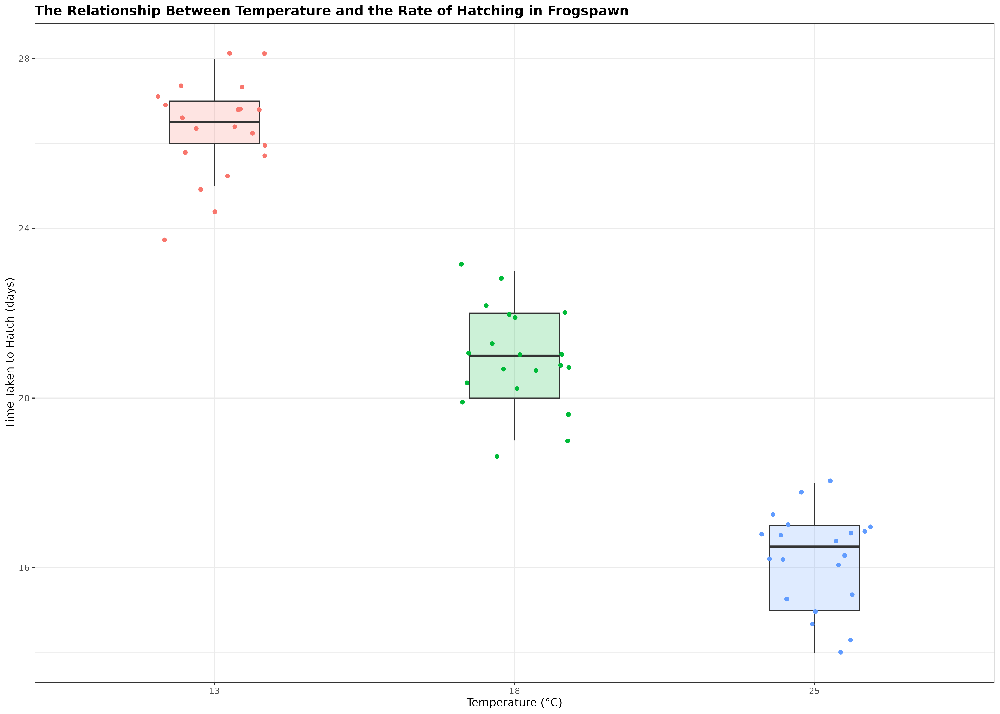

```{r setup, include=FALSE, echo = FALSE}
knitr::opts_chunk$set(echo = TRUE)
```

**Null hypothesis :**
Temperature will have no effect on the speed of frogspawn hatching. 


**Alternative hypothesis:** 
Mean frogspawn hatching time will vary with temperature level. We can predict that given our temperature range, at the highest temperature (25°C) hatching time will be reduced.  

```{r,echo = FALSE, message=FALSE}
source("scripts/frogspawn.R")

```
*Figure 1:* Frogspawn hatching times at 13, 18 and 25 degrees Celsius. Box plot displays median, hinges are first and third quartiles, whiskers extend from the hinge to 1.5x the interquartile range. Points represent individual frogspawn.  
  
  

**Summary:**
Increasing temperatures had a clear effect on reducing the time taken for frogspawn to hatch (one-way ANOVA: F2,57 = 385.9, P < 0.001). At 13°C the mean time to hatching was 26.3 days [25.8-26.8 95% CI], this reduced by an average of 5.3 days [4.57 - 6.02] at 18°C and by 10.1 days [9.37 - 10.82] at 25°C.  


